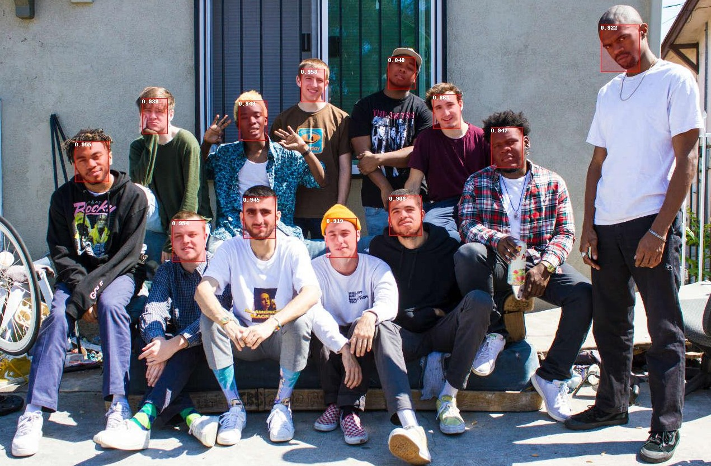
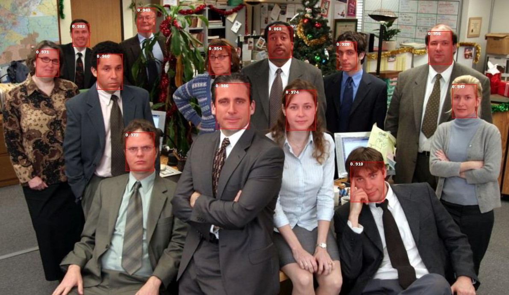
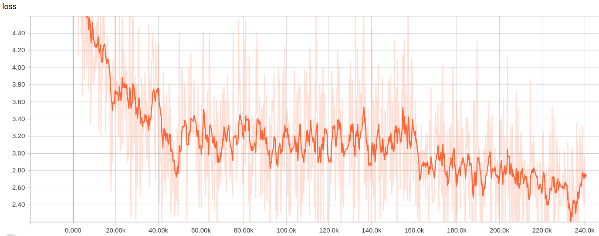

# FaceBoxes-tensorflow

This is an implementation of [FaceBoxes: A CPU Real-time Face Detector with High Accuracy](https://arxiv.org/abs/1708.05234).  
I provide full training code, data preparation scripts, and a pretrained model.  
The detector has speed **~7 ms/image** (image size is 1024x1024, video card is NVIDIA GeForce GTX 1080).

## How to use the pretrained model

To use the pretrained face detector you will need to download `face_detector.py` and  
a frozen inference graph (`.pb` file, it is [here](https://drive.google.com/drive/folders/1DYdxvMXm6n6BsOy4dOTbN9h43F0CoUoK?usp=sharing)). You can see an example of usage in `try_detector.ipynb`. 

Examples of face detections:



## Requirements

* tensorflow 1.10 (inference was tested using tensorflow 1.12)
* opencv-python, Pillow, tqdm

## Notes

1. *Warning:* This detector doesn't work well on small faces.  
But you can improve its performance if you upscale images before feeding them to the network.  
For example, resize an image keeping its aspect ratio so its smaller dimension is 768.
2. You can see how anchor densification works in `visualize_densified_anchor_boxes.ipynb`.
3. You can see how my data augmentation works in `test_input_pipeline.ipynb`.
4. The speed on a CPU is **~25 ms/image** (image size is 1024x768, model is i7-7700K CPU @ 4.20GHz).

## How to train

For training I use `train`+`val` parts of the WIDER dataset.
It is 16106 images in total (12880 + 3226).  
For evaluation during the training I use the FDDB dataset (2845 images) and `AP@IOU=0.5` metrics (it is not like in the original FDDB evaluation, but like in PASCAL VOC Challenge).

1. Run `prepare_data/explore_and_prepare_WIDER.ipynb` to prepare the WIDER dataset   
(also, you will need to combine the two created dataset parts using `cp train_part2/* train/ -a`).
2. Run `prepare_data/explore_and_prepare_FDDB.ipynb` to prepare the FDDB dataset.
3. Create tfrecords:
  ```
  python create_tfrecords.py \
      --image_dir=/home/gpu2/hdd/dan/WIDER/train/images/ \
      --annotations_dir=/home/gpu2/hdd/dan/WIDER/train/annotations/ \
      --output=data/train_shards/ \
      --num_shards=150

  python create_tfrecords.py \
      --image_dir=/home/gpu2/hdd/dan/FDDB/val/images/ \
      --annotations_dir=/home/gpu2/hdd/dan/FDDB/val/annotations/ \
      --output=data/val_shards/ \
      --num_shards=20
  ```
4. Run `python train.py` to train a face detector. Evaluation on FDDB will happen periodically.
5. Run `tensorboard --logdir=models/run00` to observe training and evaluation.
6. Run `python save.py` and `create_pb.py` to convert the trained model into a `.pb` file.
7. Use `class` in `face_detector.py` and `.pb` file to do inference.
8. Also, you can get my final training checkpoint [here](https://drive.google.com/drive/folders/1DYdxvMXm6n6BsOy4dOTbN9h43F0CoUoK?usp=sharing).
9. The training speed was `~2.6 batches/second` on one NVIDIA GeForce GTX 1080. So total training time is ~26 hours  
(and I believe that you can make it much shorter if you optimize the input pipeline).

Training loss curve looks like this:


## How to evaluate on FDDB

1. Download the evaluation code from [here](http://vis-www.cs.umass.edu/fddb/results.html).
2. `tar -zxvf evaluation.tgz; cd evaluation`.  
Then compile it using `make` (it can be very tricky to make it work).
3. Run `predict_for_FDDB.ipynb` to make predictions on the evaluation dataset.  
You will get `ellipseList.txt`, `faceList.txt`, `detections.txt`, and `images/`.
4. Run `./evaluate -a result/ellipseList.txt -d result/detections.txt -i result/images/ -l result/faceList.txt -z .jpg -f 0`.
5. You will get something like `eval_results/discrete-ROC.txt`.
6. Run `eval_results/plot_roc.ipynb` to plot the curve.

Also see this [repository](https://github.com/pkdogcom/fddb-evaluate) and the official [FAQ](http://vis-www.cs.umass.edu/fddb/faq.html) if you have questions about the evaluation.

## Results on FDDB
True positive rate at 1000 false positives is `0.902`.
Note that it is lower than in the original paper.  
Maybe it's because some hyperparameters are wrong.  
Or it's because I didn't do any upscaling of images when evaluating
(I used the original image size).


You can see the whole curve in `eval_results/discrete-ROC.txt` (it's the output of the official evaluation script).
